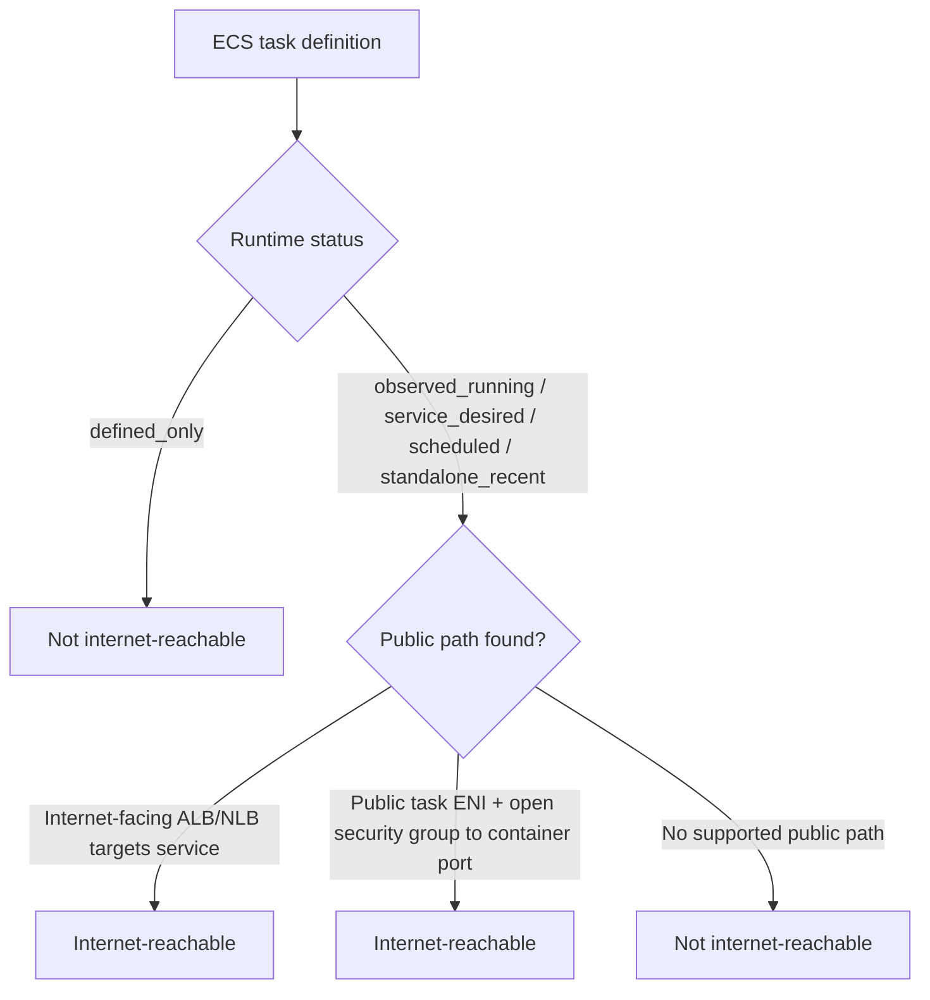
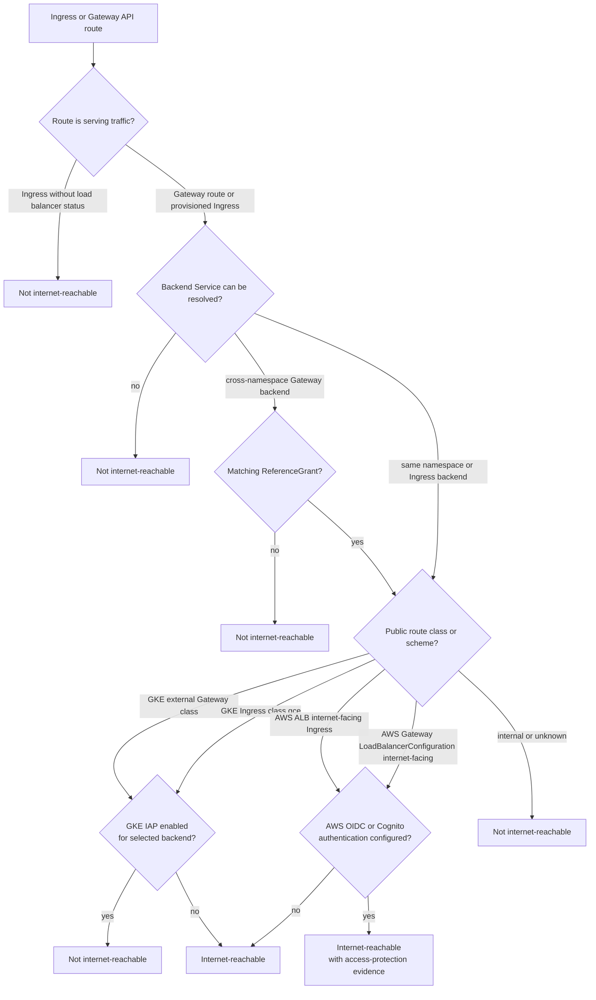
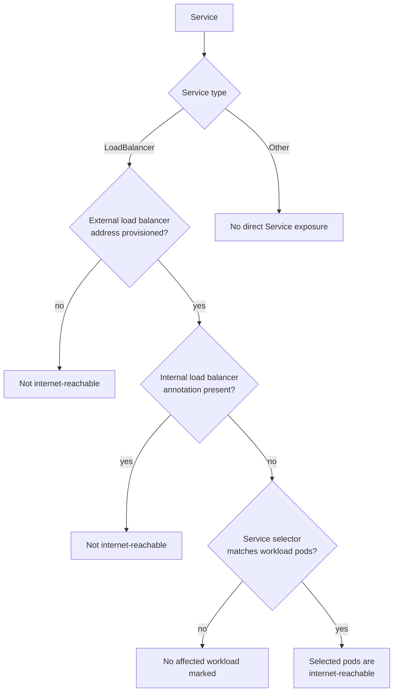
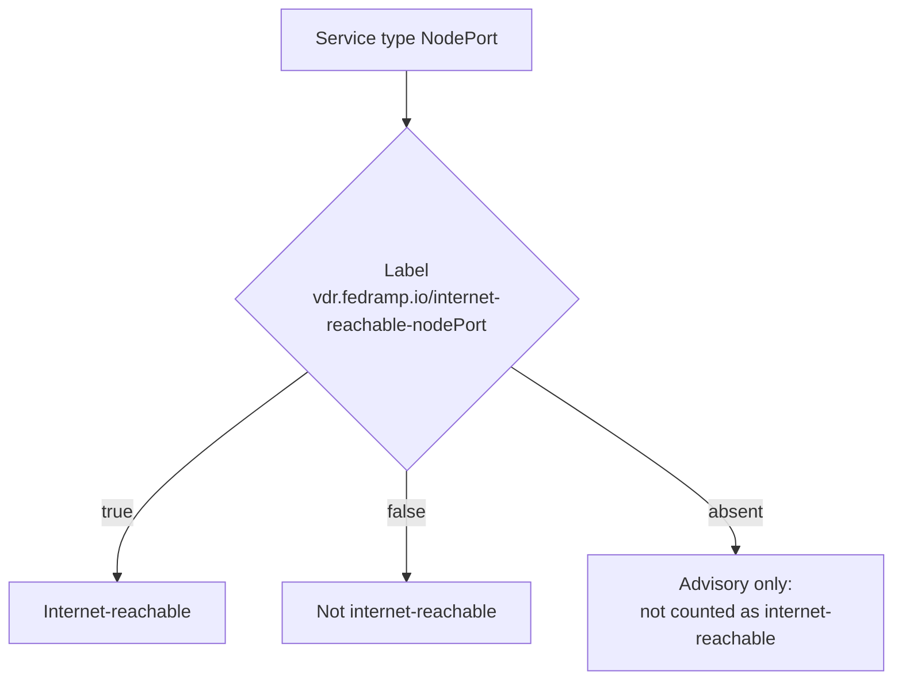
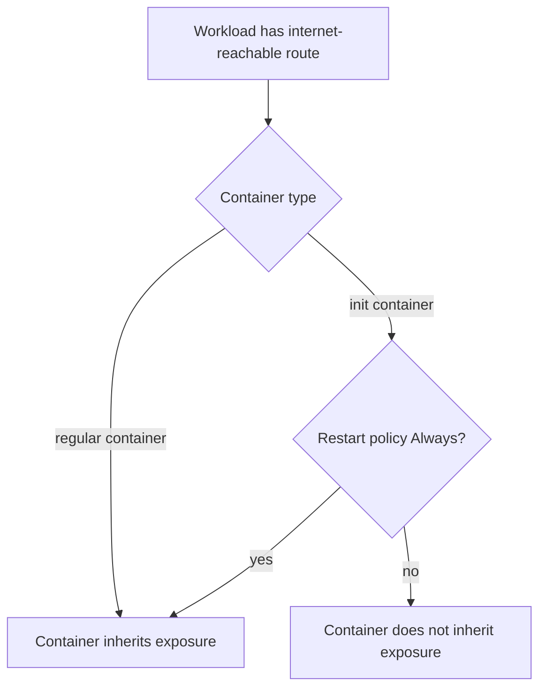

# Internet Reachability Evaluation

`vdr` uses internet reachability to set the IRV input for FedRAMP remediation deadlines. The evaluation is intentionally conservative: a resource is marked internet-reachable only when the collected platform metadata shows a public path to the affected workload and no supported access-protection control blocks unauthenticated internet access.

## Chainable entry-point flag

Each vulnerability finding carries informational `chainableEntrypoint` metadata that joins the CVE-level execution classification to the affected asset's internet exposure. Its deployed `classification` is `high_confidence` only when all three conditions hold:

1. The finding is active (not suppressed).
2. The affected asset is `internetAccessible` under the collected exposure evidence.
3. The CVE-level `candidateStatus` is `high_confidence`.

An active, internet-accessible `possible` candidate retains the deployed classification `possible`. Every other combination is `none`. This stops at the upstream signal: it does not join findings across an execution boundary, promote AV:L vulnerabilities to IRV, or change a remediation deadline.

Policy `chainable-entrypoint-v2` produces three CVE-level candidate statuses. Every heuristic branch requires `AV:N`:

- `high_confidence` for `AV:N` findings mapped to the high-signal strict execution-semantics set (`CWE-78`, `CWE-94`, `CWE-95`, `CWE-96`, `CWE-98`, `CWE-553`, `CWE-624`, or `CWE-917`), or for `AV:N` findings with full vulnerable-system C/I/A impact and the moderate-signal `CWE-97` or `CWE-494`.
- `possible` for `AV:N` plus full vulnerable-system impact without a corroborating execution signal, or for `AV:N` findings mapped to the moderate/context-dependent `CWE-97`, `CWE-470`, `CWE-494`, `CWE-829`, or `CWE-1336` that do not meet the high-confidence conjunction. Context-dependent `CWE-829` and `CWE-1336` cases remain possible because server/runtime execution context is not currently collected.
- `none` when no rule matches.

The record retains the deployed classification and its inputs (`activeFinding`, `internetAccessible`, and `candidateStatus`), the `highConfidence` flag, machine-readable reason codes, policy version, normalized CWEs, the CVSS vector and attack vector, the full-impact result, and execution-context status when relevant. Finding-centric JSON records the result on every `affected[]` asset and surfaces the strongest classification at the finding level. The HTML report filters on `high_confidence`, `possible`, and `none`, and displays high-confidence/possible results as a tooltip badge beside the CVE.

The evaluator uses only source facts present in the report. When enrichment is skipped or a CVE has no specific CWE assignment, the record preserves that absence and the classifier falls back to the available CVSS signals.

## Cloud Run

Cloud Run jobs are never counted as internet-reachable. Cloud Run services are evaluated from service ingress settings, IAM policy, and, for load-balancer-only ingress, public HTTP(S) load balancer metadata.

When load-balancer route details are available, JSON output includes informational `exposure.routes` metadata such as forwarding rule, URL map, target proxy, hostnames, paths, rewrites, backend service, selected backend Service port, targetPort, appProtocol, provider-derived backend protocol, backend protocol version, backend TLS, ALPN, and ALPN policy. These fields do not change reachability decisions by themselves.

```mermaid
flowchart TD
    cr[Cloud Run resource] --> kind{Resource kind?}
    kind -->|Job| crNoJob[Not internet-reachable]
    kind -->|Service| ingress{Service ingress}

    ingress -->|all| invoker{IAM grants allUsers<br/>roles/run.invoker?}
    invoker -->|yes| crYesAll[Internet-reachable]
    invoker -->|no| crNoIam[Not internet-reachable]

    ingress -->|internal| crNoInternal[Not internet-reachable]

    ingress -->|internal-and-cloud-load-balancing| lb{Public HTTP(S)<br/>load balancer targets service?}
    lb -->|no| crNoLb[Not internet-reachable]
    lb -->|yes| iap{Cloud Run backend<br/>IAP enabled?}
    iap -->|yes| crNoIap[Not internet-reachable]
    iap -->|no| crYesLb[Internet-reachable]
```

## AWS ECS

The ECS source inventories active task-definition revisions and attaches runtime metadata to each resource. Runtime status values are:

- `observed_running`: at least one current running task uses the task definition.
- `service_desired`: an ECS service desires tasks for the task definition, even if none are running at collection time.
- `scheduled`: an EventBridge Scheduler or EventBridge Rule target can run the task definition. The status is modeled for schedule evidence, but AWS EventBridge schedule collection is not yet implemented.
- `standalone_recent`: a recently observed one-off task uses the task definition.
- `defined_only`: the task definition exists, but no service, schedule, or running task evidence was collected.

`defined_only` task definitions are not counted as internet-reachable by default. ECS reachability is counted only when runtime evidence can be tied to a public path, such as an internet-facing ALB/NLB service path or a running awsvpc task ENI with a public IP and a security group allowing internet ingress to a mapped container port.



ECS task-definition `repositoryCredentials` Secrets Manager values are used only for scan-time registry authentication. Reports include secret counts/source types, not secret values.

## Kubernetes Ingress And Gateway

Kubernetes route evaluation starts from Ingress and Gateway API objects, resolves their backend Services, then maps those Services to selected workload pods and containers. Provider-specific public/private class and scheme metadata decides whether the route represents a public path.

Service selectors are matched against actual pod or pod-template labels, never workload-controller metadata labels. Batch `Job` and `CronJob` resources are excluded from stable Service-backed internet exposure; a matching label on a batch controller does not make that resource IRV.



Notes:

- GKE Gateway is public only for known external GKE Gateway classes.
- GKE Ingress is public for `gce`; `gce-internal` is not public.
- GKE IAP is detected through `GCPBackendPolicy` for Gateway backends and `BackendConfig` for Ingress backends. Ingress `BackendConfig` lookup follows the Service port selected by the route; per-port mappings override `default`.
- AWS ALB Ingress and AWS Gateway are public only when their scheme or load balancer configuration is `internet-facing`.
- AWS `oidc` and `cognito` authentication are recorded as access-protection evidence, but the backend still has an internet-facing route.
- If an unprovisioned Ingress and a Gateway both target the same Service, the Gateway route can still make the workload internet-reachable.
- JSON output includes informational `exposure.routes` metadata when available. Ingress metadata can include hostnames and paths. Gateway API metadata can include hostnames, path matches, header matches, URL rewrite filters, request redirects, backend Service references, selected backend Service port details, and provider-derived protocol hints.
- AWS ALB Ingress protocol hints are derived from `alb.ingress.kubernetes.io/backend-protocol` and `alb.ingress.kubernetes.io/backend-protocol-version`; Service annotations take precedence over Ingress annotations when both are present.
- AWS Gateway protocol hints are derived from `gateway.k8s.aws` `TargetGroupConfiguration.spec.protocol` and `spec.protocolVersion` for the selected backend Service.
- GKE Ingress backend protocol hints are derived from `cloud.google.com/app-protocols` on the selected backend Service when the referenced Service port can be resolved.

### Operator-declared classes

When an edge load balancer is built outside Kubernetes (for example ingress-nginx
or a custom Gateway fronted by a standalone-NEG / Terraform L7 LB), the cluster
cannot infer reachability. An operator can declare it two ways:

- **Per-resource label** `vdr.fedramp.io/internet-reachable` on an `IngressClass`
  (`true` treats every Ingress using that class as public; `false` suppresses even
  a built-in public class such as `gce`).
- **Central ConfigMap list** in `fedramp-vdr-trivy/vdr-fedramp`. List class names under
  `internetAccessibleIngressClasses` and/or `internetAccessibleGatewayClasses`;
  any Ingress/Gateway using a listed class is treated as internet-reachable. This
  avoids labeling resources directly, which is brittle when labels are applied by a
  Helm chart onto undesired resources or reverted by a managed reconciler. Each
  value is a YAML list, or a newline- or comma-separated string of class names.

  ```yaml
  data:
    internetAccessibleIngressClasses: |
      - nginx
    internetAccessibleGatewayClasses: |
      - istio
  ```

  Precedence: a per-class `vdr.fedramp.io/internet-reachable` label (including
  `false`) wins over the ConfigMap list. Built-in public classes stay public.
  GatewayClass has no label mechanism, so the ConfigMap list is its only override.

## Kubernetes Service LoadBalancer

A `Service` of type `LoadBalancer` can expose the pods it selects directly. This catches data-path pods for ingress and gateway controllers such as Traefik, ingress-nginx, and Envoy without relying on controller names.

For direct `Service type=LoadBalancer` exposure, `exposure.routes` includes one route metadata entry per Service port so multi-port Services preserve which ports are externally reachable. For AWS NLB Services, `exposure.routes` also records `service.beta.kubernetes.io/aws-load-balancer-alpn-policy` when present and expands known policies into normalized ALPN hints such as `h2` and `http/1.1`.



Internal load balancer annotations include:

- GKE: `networking.gke.io/load-balancer-type: Internal`
- AWS: `aws-load-balancer-scheme: internal`
- Azure: `azure-load-balancer-internal: "true"`

## Kubernetes Service NodePort

NodePort reachability depends on node public IPs and firewall rules, which are not reliably visible from Kubernetes API objects alone. `vdr` records unlabeled NodePort Services as advisory evidence but does not count them as internet-reachable unless the operator labels the Service.



## Container Exposure Inheritance

When a workload is internet-reachable, normal containers inherit that exposure. Init containers do not inherit exposure unless they are sidecar-style init containers with restart policy `Always`.


